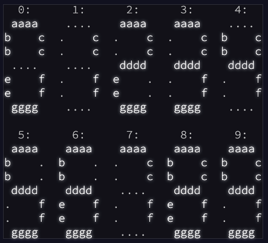

# 🎄 🎅 🎄 Day 8: Seven Segment Search 🎄 🎅 🎄

You barely reach the safety of the cave when the whale smashes into the cave mouth, collapsing it. Sensors indicate another exit to this cave at a much greater depth, so you have no choice but to press on.

As your submarine slowly makes its way through the cave system, you notice that the four-digit seven-segment displays in your submarine are malfunctioning; they must have been damaged during the escape. You'll be in a lot of trouble without them, so you'd better figure out what's wrong.

🎄 🎄 🎄 🎄 🎄 🎄 🎄 🎄 🎄 🎄 🎄 🎄 🎄 🎄 🎄 🎄 🎄 🎄 🎄 🎄

## Part 1

Each digit of a seven-segment display is rendered by turning on or off any of seven segments named a through g:



So, to render a 1, only segments c and f would be turned on; the rest would be off. To render a 7, only segments a, c, and f would be turned on.

The problem is that the signals which control the segments have been mixed up on each display. The submarine is still trying to display numbers by producing output on signal wires a through g, but those wires are connected to segments randomly. Worse, the wire/segment connections are mixed up separately for each four-digit display! (All of the digits within a display use the same connections, though.)

So, you might know that only signal wires b and g are turned on, but that doesn't mean segments b and g are turned on: the only digit that uses two segments is 1, so it must mean segments c and f are meant to be on. With just that information, you still can't tell which wire (b/g) goes to which segment (c/f). For that, you'll need to collect more information.

For each display, you watch the changing signals for a while, make a note of all ten unique signal patterns you see, and then write down a single four digit output value (your puzzle input). Using the signal patterns, you should be able to work out which pattern corresponds to which digit.

For example, here is what you might see in a single entry in your notes:

```
acedgfb cdfbe gcdfa fbcad dab cefabd cdfgeb eafb cagedb ab |
cdfeb fcadb cdfeb cdbaf
```

(The entry is wrapped here to two lines so it fits; in your notes, it will all be on a single line.)

Each entry consists of ten unique signal patterns, a | delimiter, and finally the four digit output value. Within an entry, the same wire/segment connections are used (but you don't know what the connections actually are). The unique signal patterns correspond to the ten different ways the submarine tries to render a digit using the current wire/segment connections. Because 7 is the only digit that uses three segments, dab in the above example means that to render a 7, signal lines d, a, and b are on. Because 4 is the only digit that uses four segments, eafb means that to render a 4, signal lines e, a, f, and b are on.

Using this information, you should be able to work out which combination of signal wires corresponds to each of the ten digits. Then, you can decode the four digit output value. Unfortunately, in the above example, all of the digits in the output value (cdfeb fcadb cdfeb cdbaf) use five segments and are more difficult to deduce.

For now, focus on the easy digits. Consider this larger example:


Because the digits 1, 4, 7, and 8 each use a unique number of segments, you should be able to tell which combinations of signals correspond to those digits. Counting only digits in the output values (the part after | on each line), in the above example, there are 26 instances of digits that use a unique number of segments (highlighted above).

In the output values, how many times do digits 1, 4, 7, or 8 appear?

[Solution Part 1](./part1/index.ts)

🎄 🎄 🎄 🎄 🎄 🎄 🎄 🎄 🎄 🎄 🎄 🎄 🎄 🎄 🎄 🎄 🎄 🎄 🎄 🎄

## Part 2

<--TEXT-->

[Solution Part 2](./part2/index.ts)

🎄 🎄 🎄 🎄 🎄 🎄 🎄 🎄 🎄 🎄 🎄 🎄 🎄 🎄 🎄 🎄 🎄 🎄 🎄 🎄
