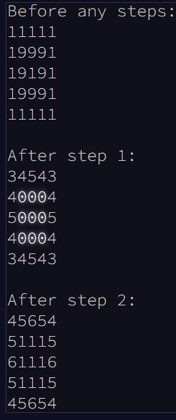
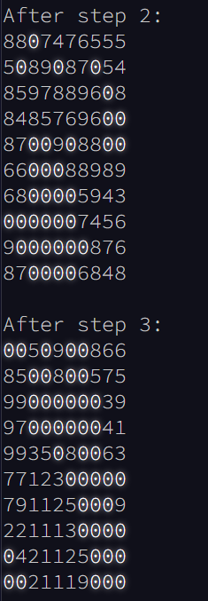
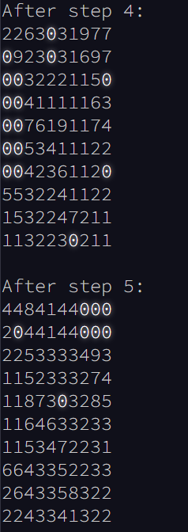
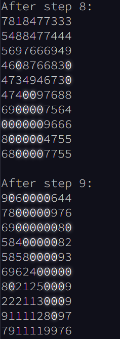
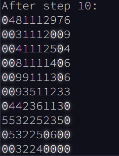
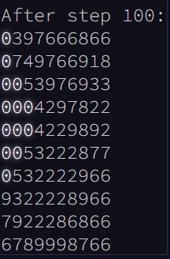

# 🎄 🎅 🎄 Day 11: Dumbo Octopus 🎄 🎅 🎄

You enter a large cavern full of rare bioluminescent dumbo octopuses! They seem to not like the Christmas lights on your submarine, so you turn them off for now.

🎄 🎄 🎄 🎄 🎄 🎄 🎄 🎄 🎄 🎄 🎄 🎄 🎄 🎄 🎄 🎄 🎄 🎄 🎄 🎄

## Part 1

There are 100 octopuses arranged neatly in a 10 by 10 grid. Each octopus slowly gains energy over time and flashes brightly for a moment when its energy is full. Although your lights are off, maybe you could navigate through the cave without disturbing the octopuses if you could predict when the flashes of light will happen.

Each octopus has an energy level - your submarine can remotely measure the energy level of each octopus ([your puzzle input](data/input.txt)). For example:

```
5483143223
2745854711
5264556173
6141336146
6357385478
4167524645
2176841721
6882881134
4846848554
5283751526
```

The energy level of each octopus is a value between 0 and 9. Here, the top-left octopus has an energy level of 5, the bottom-right one has an energy level of 6, and so on.

You can model the energy levels and flashes of light in steps. During a single step, the following occurs:

- First, the energy level of each octopus increases by 1.
- Then, any octopus with an energy level greater than 9 flashes. This increases the energy level of all adjacent octopuses by 1, including octopuses that are diagonally adjacent. If this causes an octopus to have an energy level greater than 9, it also flashes. This process continues as long as new octopuses keep having their energy level increased beyond 9. (An octopus can only flash at most once per step.)
- Finally, any octopus that flashed during this step has its energy level set to 0, as it used all of its energy to flash.

Adjacent flashes can cause an octopus to flash on a step even if it begins that step with very little energy. Consider the middle octopus with 1 energy in this situation:



An octopus is highlighted when it flashed during the given step.

Here is how the larger example above progresses:







After step 10, there have been a total of 204 flashes. Fast forwarding, here is the same configuration every 10 steps:




After 100 steps, there have been a total of 1656 flashes.

Given the starting energy levels of the dumbo octopuses in your cavern, simulate 100 steps. How many total flashes are there after 100 steps?

[Solution Part 1](./part1/index.ts)

🎄 🎄 🎄 🎄 🎄 🎄 🎄 🎄 🎄 🎄 🎄 🎄 🎄 🎄 🎄 🎄 🎄 🎄 🎄 🎄

## Part 2

It seems like the individual flashes aren't bright enough to navigate. However, you might have a better option: the flashes seem to be synchronizing!

In the example above, the first time all octopuses flash simultaneously is step 195:

After step 193:

```
5877777777
8877777777
7777777777
7777777777
7777777777
7777777777
7777777777
7777777777
7777777777
7777777777
```

After step 194:

```
6988888888
9988888888
8888888888
8888888888
8888888888
8888888888
8888888888
8888888888
8888888888
8888888888
```

After step 195:

````
0000000000
0000000000
0000000000
0000000000
0000000000
0000000000
0000000000
0000000000
0000000000
0000000000
If ```
you can calculate the exact moments when the octopuses will all flash simultaneously, you should be able to navigate through the cavern. What is the first step during which all octopuses flash?

[Solution Part 2](./part2/index.ts)

🎄 🎄 🎄 🎄 🎄 🎄 🎄 🎄 🎄 🎄 🎄 🎄 🎄 🎄 🎄 🎄 🎄 🎄 🎄 🎄
````
