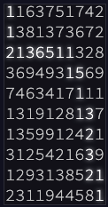

# 🎄 🎅 🎄 Day 15: Chiton 🎄 🎅 🎄

You've almost reached the exit of the cave, but the walls are getting closer together. Your submarine can barely still fit, though; the main problem is that the walls of the cave are covered in chitons, and it would be best not to bump any of them.

🎄 🎄 🎄 🎄 🎄 🎄 🎄 🎄 🎄 🎄 🎄 🎄 🎄 🎄 🎄 🎄 🎄 🎄 🎄 🎄

## Part 1

The cavern is large, but has a very low ceiling, restricting your motion to two dimensions. The shape of the cavern resembles a square; a quick scan of chiton density produces a map of risk level throughout the cave ([your puzzle input](data/input.txt)). For example:

```
1163751742
1381373672
2136511328
3694931569
7463417111
1319128137
1359912421
3125421639
1293138521
2311944581
```

You start in the top left position, your destination is the bottom right position, and you cannot move diagonally. The number at each position is its risk level; to determine the total risk of an entire path, add up the risk levels of each position you enter (that is, don't count the risk level of your starting position unless you enter it; leaving it adds no risk to your total).

Your goal is to find a path with the lowest total risk. In this example, a path with the lowest total risk is highlighted here:



The total risk of this path is 40 (the starting position is never entered, so its risk is not counted).

What is the lowest total risk of any path from the top left to the bottom right?

[Solution Part 1](./part1/index.ts)

🎄 🎄 🎄 🎄 🎄 🎄 🎄 🎄 🎄 🎄 🎄 🎄 🎄 🎄 🎄 🎄 🎄 🎄 🎄 🎄

## Part 2

<--TEXT-->

[Solution Part 2](./part2/index.ts)

🎄 🎄 🎄 🎄 🎄 🎄 🎄 🎄 🎄 🎄 🎄 🎄 🎄 🎄 🎄 🎄 🎄 🎄 🎄 🎄
